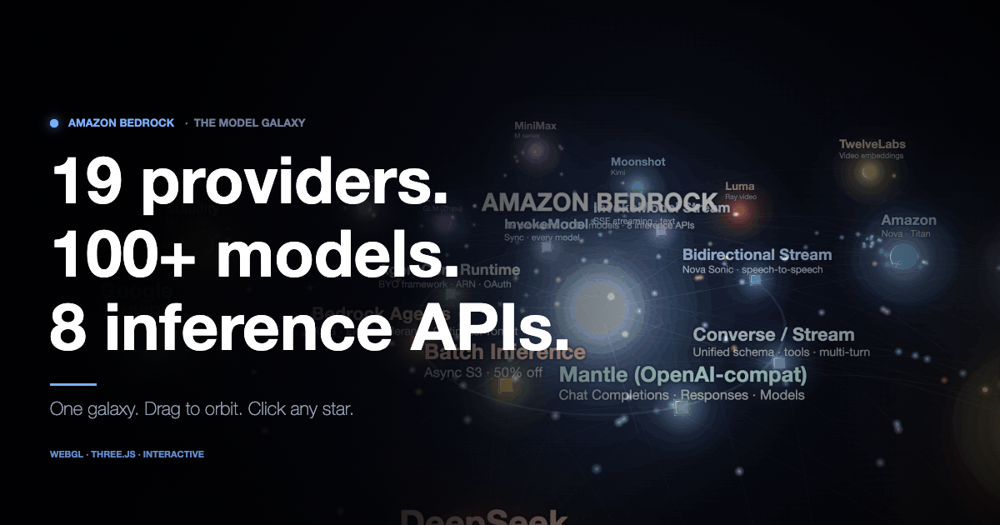

# Amazon Bedrock — The Model Galaxy

An interactive 3D visualization of the entire Amazon Bedrock model catalog as a galaxy.

**18 providers. 100+ models. 8 inference APIs.** Every beam is a real capability path.



## 🚀 [Live demo →](https://madhupai-aws.github.io/bedrock-galaxy/)

## What you're looking at

- **Center core** — Amazon Bedrock
- **Orbiting suns** — each of the 18 model providers (Amazon, Anthropic, Meta, Mistral, Cohere, AI21, DeepSeek, Qwen, OpenAI, Google, NVIDIA, Stability, Writer, Z AI, MiniMax, Moonshot, Luma, TwelveLabs)
- **Small stars around each sun** — individual models in that provider's family
- **Tilted inner ring** — the 8 inference API surfaces (InvokeModel, Converse, Mantle, Batch, Agents, AgentCore, Nova Sonic bidirectional, streaming)
- **Pulsing beams** — which APIs actually support which providers

## Controls

| | |
|---|---|
| **Drag** | orbit the camera |
| **Scroll** | zoom in / out |
| **Click** a provider sun or API node | detail panel |
| **Replay intro** | re-run the cinematic camera sweep |

## Built with

- [Three.js](https://threejs.org/) (r160)
- Vanilla JS, no framework, single-page
- Data distilled from the Bedrock pricing page + docs (March 2026)

## Run locally

It's all static files — just open `index.html`, or serve with any static server:

```bash
python3 -m http.server 8000
# then visit http://localhost:8000
```

## Files

- `index.html` — shell, UI chrome, loader
- `galaxy.js` — the Three.js scene
- `data.js` — provider / model / API data

## License

MIT. Use it however you like.
